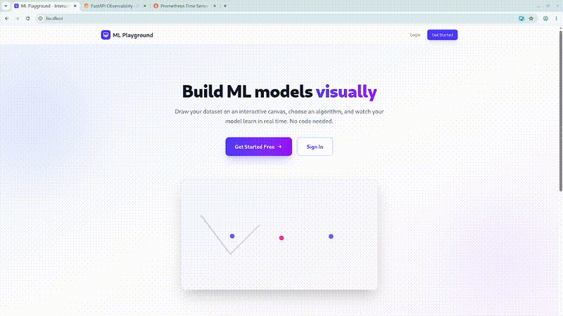

<h1 align="center">
  
  <br>
  ML Playground
</h1>

<h4 align="center">Draw data. Tune models. See results. <em>No code, no setup.</em></h4>

<p align="center">
  <a href="#key-features">Features</a> •
  <a href="#tech-stack">Tech Stack</a> •
  <a href="#quick-start">Quick Start</a> •
  <a href="#development-setup">Dev Setup</a> •
  <a href="docs/">Documentation</a>
</p>

<p align="center">
  <a href="https://github.com/xadla/ml-playground/actions/workflows/ci.yml"></a>
  <a href="https://github.com/xadla/ml-playground/actions/workflows/lint.yml"></a>
  
  
  
  
  
  
  
  
  
</p>

<!-- Main demo GIF or screenshot -->
<p align="center">
  
</p>

---

## Why this exists

Beginners hit walls with setup and code‑first approaches.
**ML Playground** gives them a visual sandbox to:

- 🎨 **Draw datasets** by clicking on a 2D canvas
- 🧠 **Pick a classical ML algorithm** (Logistic Regression, Decision Tree, k‑NN, K‑Means)
- 🎛️ **Tune hyperparameters** with sliders
- 📊 **See instant metrics, confusion matrices, and decision boundaries**
- 🔐 **Save experiments** to your personal history and compare them side‑by‑side

👉 [Read the full project vision](docs/goal.md)

---

## Key Features

- ✏️ **Visual point‑and‑click data canvas** – create classification datasets by placing points, no spreadsheets needed
- 📁 **Upload your own CSV** or start from a built‑in dataset (Iris, Wine, …)
- ⚙️ **4 classical algorithms** with interactive hyperparameter controls
- ⚡ **Asynchronous training** – the UI stays snappy while models train in the background
- 📈 **Instant results** – accuracy, precision, recall, F1‑score, confusion matrix heatmap, decision boundary plot
- 🔒 **User accounts** – sign up, log in, save experiments, and compare past runs
- 🐳 **One‑command startup** with Docker – zero‑dependency local development
- 📚 **Fully documented** – from vision to deployment
- ✅ **Professional code quality** – pre-commit hooks, Ruff, MyPy, ESLint, Prettier, GitHub Actions CI

---

## Tech Stack

| Layer | Technology |
|-------|------------|
| **Frontend** | React 18, Vite, Tailwind CSS, Recharts, React Query |
| **Backend** | FastAPI (Python 3.11), Uvicorn, Celery, Redis |
| **ML / Scientific** | scikit‑learn, numpy, matplotlib |
| **Database** | PostgreSQL 16, SQLAlchemy 2.0 (async), Alembic |
| **Web Server** | Nginx (reverse proxy, TLS termination, static files) |
| **Containerization** | Docker, docker‑compose |
| **CI/CD** | GitHub Actions |
| **Code Quality** | Ruff (lint+format), MyPy (type checking), pre‑commit, ESLint, Prettier |

---

## Quick Start

```bash
# 1. Clone the repo
git clone https://github.com/your-username/ml-playground.git
cd ml-playground

# 2. Set up environment variables
cp .env.example .env
# Edit .env with your secrets (JWT_SECRET, database password, etc.)

# 3. Start everything
docker-compose up --build

# 4. Open the app
open http://localhost
```

## Development Setup

**Prerequisites**: Python 3.11+, Node.js 20+, Docker (optional for full stack)

If you want to run the project **without Docker** (for faster iteration) or contribute code, follow this setup.

### 1. Backend (FastAPI)

```bash
cd backend
python -m venv .venv
source .venv/bin/activate  # or `.venv\Scripts\activate` on Windows
pip install -r requirements-dev.txt
```

### 2. Frontend (React + Vite)

```bash
cd frontend
npm install
```

### 3. Code Quality Tools – mandatory before committing

We use pre-commit to automatically run Ruff, MyPy, ESLint and Prettier on every commit.
This ensures consistent style and catches bugs early.

```bash
# From the project root (ml-playground/)
pip install pre-commit
pre-commit install          # installs git hook scripts
pre-commit run --all-files  # optional: run on all existing files
```

Now every git commit will automatically:

- Lint & format Python with Ruff
- Type‑check Python with MyPy (strict mode)
- Lint TypeScript/React with ESLint
- Format frontend code with Prettier
- Validate YAML/JSON, trim whitespace, detect secrets, etc.

> **Note**: If a hook fails, the commit is blocked. Fix the issues and try again.
> You can run hooks manually: `pre-commit run --all-files`

### 4. Running without Docker (for development)

**Terminal 1 – Backend**
```bash
cd backend
source .venv/bin/activate
uvicorn app.main:app --reload --port 8000
```

**Terminal 2 – Celery worker** (for ML training)
```bash
cd backend
celery -A app.tasks worker --loglevel=info
```

**Terminal 3 – Frontend**
```bash
cd frontend
npm run dev
```

Now visit `http://localhost:5173`

## Documentation

All project documentation lives in the `docs/` folder.

Highly recommended reading for contributors and curious engineers:

| Document | Description |
|----------|-------------|
| Project Vision | Why this project exists and for whom |
| Requirements | Full functional & non‑functional specs |
| User Stories | 27 stories with priorities and traceability |
| Tech Stack | Tooling choices and justifications |
| Database Schema | ERD, table definitions, design rationale |
| Architecture Overview | System design, data flows, component details |
| API Specification | All REST endpoints and examples |
| Deployment Plan | CI/CD, containerization, TLS, scaling |
| Wireframes | UI mockups (coming soon) |

---

## Architecture at a Glance

```text
Browser → Nginx (TLS) → React (static) + FastAPI (api)
                       → Celery Worker (ML training)
                       → PostgreSQL (data) + Redis (queue)
```

[Full architecture diagram and explanation →](docs/architecture.md)

## Contributing

We welcome contributions – new algorithms, better visualizations, dataset features, performance improvements.

### Before you start

- Read the [project vision](docs/goal.md) and [requirements](docs/requirements.md)
- Make sure you've set up **pre-commit** hooks (see [Development Setup](#development-setup))
- Run `pre-commit run --all-files` to verify your environment works

### Pull request checklist

- [ ] Code is formatted – Ruff & Prettier will enforce this automatically
- [ ] Type hints exist for all Python functions (MyPy in strict mode)
- [ ] Frontend changes pass `npm run lint` and `npm run format`
- [ ] No `console.log`, no commented‑out code
- [ ] Update documentation if you change behaviour

**GitHub Actions** will run the exact same checks on every pull request.
If the CI fails, your PR cannot be merged.

See `CONTRIBUTING.md` for detailed guidelines.
