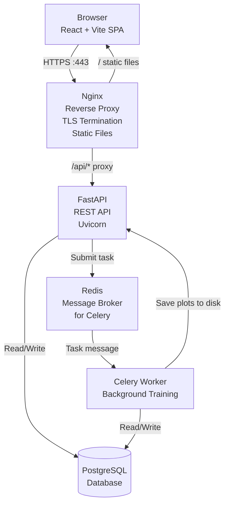
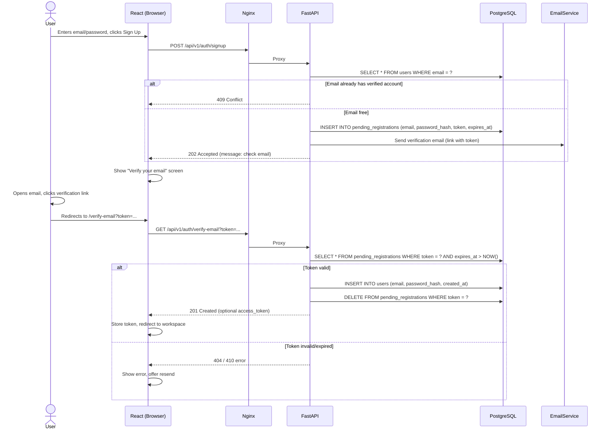

# Architecture & Technical Overview – ML Playground

**Version:** 1.0
**Date:** 2026-06-07
**Author:** Mohammadhadi

---

## 1. High‑Level Architecture (Container Diagram)

The system follows a **single‑page application (SPA) with an async backend** pattern, deployed as a set of Docker containers orchestrated via `docker-compose`.


**Key:**
- **Client** – React app built with Vite, served as static files.
- **Nginx** – single entry point. Routes /api/ to FastAPI, everything else to static frontend. Handles HTTPS, caching, gzip.
- **FastAPI** – handles authentication, dataset management, experiment submission, and history retrieval. All synchronous I/O is offloaded to Celery.
- **Celery** – executes scikit‑learn training jobs asynchronously. Communicates via Redis.
- **Redis** – message broker for Celery. Also usable for rate limiting and session caching in the future.
- **PostgreSQL** – stores users, datasets, experiments, and results (see database schema).

## 2. Component Descriptions

### 2.1 Nginx (Reverse Proxy)
- **Config file:** `nginx/nginx.conf` (mounted into container)
- **Routing rules:**
  - `/api/` → `http://backend:8000/api/` (FastAPI)
  - `/` → serves built React files from `/usr/share/nginx/html`
- **Security headers:** HSTS, X‑Frame‑Options, Content‑Security‑Policy (to be added)
- **TLS:** In production, uses Let’s Encrypt certificates via Certbot or a managed load balancer

### 2.2 Frontend (React + Vite)
- **Entry point:** `frontend/src/main.jsx`
- **Routing:** React Router handles:
  - `/` – Workspace (canvas, config, results)
  - `/history` – Experiment history (protected)
  - `/compare` – Experiment comparison (protected)
  - `/login` / `/signup` – Authentication modals/routes
- **State management:**
  - **Server state:** React Query caches API responses (datasets, experiments, results), handles polling for training status
  - **Client state:** React context or simple `useState` for canvas drawing state, selected algorithm, etc.
- **API calls:** Axios instance with interceptors to attach JWT from storage
- **Canvas:** Custom component using HTML5 Canvas or SVG. Points stored as `[{x, y, class}]` array. On “Run”, canvas data is sent to backend as JSON
- **Charts:** Recharts for metric cards, confusion matrix heatmap, and scatter plots. Decision boundary plot is returned as a static image from backend (or rendered via a canvas component consuming plot data)

### 2.3 Backend (FastAPI)
- **Structure (modular):**
```text
backend/app/
├── main.py # FastAPI app creation, middleware, startup
├── core/
│ ├── config.py # Settings from .env
│ ├── security.py # JWT encoding/decoding, password hashing
│ └── database.py # Async engine, session factory
├── models/ # SQLAlchemy ORM models (User, Dataset, etc.)
├── schemas/ # Pydantic request/response models
├── api/ # Routers (v1/)
│ ├── auth.py
│ ├── datasets.py
│ ├── experiments.py
│ └── results.py
├── services/ # Business logic
│ ├── auth_service.py
│ ├── dataset_service.py
│ ├── experiment_service.py
│ └── ml_service.py # scikit-learn orchestration (called by Celery)
└── tasks/ # Celery task definitions
└── train.py
```
- **Authentication flow:**
  - **Signup:** `POST /auth/signup` validates email (not already used by a verified user), creates a pending registration record in a separate table (pending_registrations), generates a unique token (expires in 24h), sends verification email. Returns 202 Accepted (no user account created, no JWT).
  - **Verification:** `GET /auth/verify-email?token=...` checks the token, if valid creates a new row in users table (with the email and password hash from the pending record), deletes the pending registration, and optionally returns a JWT access token.
  - **Login:** `POST /auth/login` only works for existing users (who have completed verification). Returns JWT.
  - **Protected endpoints** (history, save experiment) – require a valid JWT, which implies the user is verified (since only verified users have a user record).
- **Async training flow:**
  - `POST /api/v1/experiments` → creates experiment row with status `pending`
  - Sends a Celery task `train_model(experiment_id)`
  - Returns `202 Accepted` with experiment ID
  - Frontend polls `GET /api/v1/experiments/{id}` or uses React Query background refetching
  - Celery worker picks task, runs scikit‑learn, saves experiment_results row, updates status to `completed` or `failed`

### 2.4 Celery Worker
- **Task definition:** `train_model(experiment_id)`
- **Flow:**
  - Load experiment and dataset from DB
  - If dataset type is `canvas`, deserialize points to numpy array; if `uploaded`, read CSV from disk; if `builtin`, load from server data folder
  - Instantiate scikit‑learn model with hyperparameters stored in experiment JSON
  - Fit model, compute metrics, generate confusion matrix data and plot images (save to `/app/plots/`)
  - Create `ExperimentResult` row, update experiment status
- **Concurrency:** Worker can be scaled (up to `--concurrency=4`) to handle multiple training jobs

### 2.5 PostgreSQL
- Schema as defined in `database-schema.md`
- Accessed only by FastAPI and Celery (not directly by frontend)
- Connection pooling managed by SQLAlchemy async engine (with `asyncpg`)

### 2.6 Redis
- Acts as the message broker for Celery (no other use in MVP)
- Can be extended to cache frequent queries (e.g., list of built‑in datasets) or store rate‑limit counters

## 3. Data Flow: From Canvas Click to Saved Result
This end‑to‑end trace shows how a user’s hand‑drawn dataset becomes a trained model with results.


## 4. Deployment Architecture (docker-compose)
```yaml
services:
  nginx:
    image: nginx:1.25
    ports:
      - "80:80"
      - "443:443"
    volumes:
      - ./nginx/nginx.conf:/etc/nginx/nginx.conf
      - frontend_build:/usr/share/nginx/html
    depends_on:
      - backend

  frontend:
    build: ./frontend
    volumes:
      - frontend_build:/app/dist  # Vite build output

  backend:
    build: ./backend
    expose:
      - "8000"
    environment:
      - DATABASE_URL=postgresql+asyncpg://user:pass@db:5432/mlplayground
      - REDIS_URL=redis://redis:6379/0
      - JWT_SECRET=${JWT_SECRET}
    depends_on:
      - db
      - redis

  celery_worker:
    build: ./backend
    command: celery -A app.tasks.train worker --loglevel=info
    environment:
      - DATABASE_URL=postgresql+asyncpg://user:pass@db:5432/mlplayground
      - REDIS_URL=redis://redis:6379/0
    depends_on:
      - db
      - redis

  db:
    image: postgres:16
    volumes:
      - postgres_data:/var/lib/postgresql/data
    environment:
      - POSTGRES_USER=user
      - POSTGRES_PASSWORD=pass
      - POSTGRES_DB=mlplayground

  redis:
    image: redis:7-alpine

volumes:
  postgres_data:
  frontend_build:
```
**Key points:**
- The frontend is built as a Docker image, but the final static files are served by Nginx for efficiency.
- The backend and Celery worker share the same codebase but are different processes.
- No ports are exposed for backend, worker, or database — only Nginx faces the public.

## 5. Security Architecture
- **TLS termination:** Nginx handles HTTPS (production), ensuring encrypted transport
- **Authentication:** JWT tokens (signed, with expiry). Passwords hashed with bcrypt
- **Input validation:** Pydantic schemas on every endpoint. File upload size limits and MIME type checks
- **Rate limiting:** Nginx can apply basic rate limiting; backend can use `slowapi` for per‑endpoint limits (e.g., `/login`)
- **Pending registration expiration:** tokens automatically expire after 24 hours. No orphaned accounts are created.
- **SQL injection prevention:** SQLAlchemy ORM with parameterized queries
- **Data isolation:** Users can only access their own experiments, datasets, and history (enforced by query filters). Pending registrations are isolated by token (unguessable UUID) and expire automatically.
- **Ephemeral storage:** Uploaded files are stored temporarily; periodic cleanup of temporary datasets

## 6. Monitoring & Observability (Future)
- **Logging:** Structured JSON logs from FastAPI and Celery to stdout, collected by Docker
- **Metrics:** Prometheus exporter for FastAPI (e.g., `prometheus-fastapi-instrumentator`) to track request duration, training job counts
- **Health checks:** `/api/health` endpoint returning DB and Redis status

## 7. Scaling Strategy
- **Vertical first:** Increase Celery worker concurrency, database connection pool size
- **Horizontal:** Run multiple Celery workers; add more backend instances behind Nginx load balancing
- **Database:** Move to managed PostgreSQL (e.g., AWS RDS) for high availability
- **File storage:** Migrate plots and uploaded files from local disk to S3‑compatible object storage

*This architecture is designed to be simple enough for a single developer, yet follows patterns that scale to production.*
