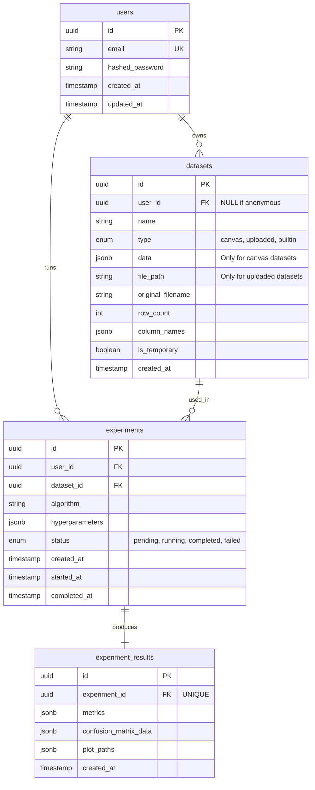

# Database Schema – ML Playground

**Version:** 1.0
**Date:** 2026-06-06
**Author:** Mohammadhadi
**Database:** PostgreSQL 16+
**ORM:** SQLAlchemy 2.0 (async) + Alembic for migrations

---

## 1. Entity‑Relationship Diagram (ERD)


## 2. Table Definitions

### 2.1 `users`
Stores registered user accounts. Passwords are hashed with bcrypt.

| Column | Type | Constraints | Description |
|--------|------|-------------|-------------|
| `id` | `UUID` | `PRIMARY KEY DEFAULT gen_random_uuid()` | Unique user identifier. |
| `email` | `VARCHAR(255)` | `UNIQUE NOT NULL` | User email, used for login. Case‑insensitive unique index. |
| `hashed_password` | `VARCHAR(255)` | `NOT NULL` | bcrypt hash of the password. |
| `is_active` | `BOOLEAN` | `DEFAULT TRUE` | Soft delete / disable account. |
| `created_at` | `TIMESTAMPTZ` | `DEFAULT NOW()` | Account creation time. |
| `updated_at` | `TIMESTAMPTZ` | `DEFAULT NOW()` | Last update time (e.g., password change). |

**Indexes:**
- `idx_users_email` (unique, lower‑case) – speeds up login lookups.
- `idx_users_created_at` – for potential admin sorting.

---

### 2.2 `datasets`
Represents a dataset used in experiments. Can be of three types:
- **canvas** – created with the point‑and‑click tool. The actual points are stored in the `data` JSONB column.
- **uploaded** – a CSV file uploaded by the user. The file is stored on disk/S3, metadata is kept here.
- **builtin** – a sample dataset (e.g., Iris). No data is stored; only the name is referenced.

Anonymous users can create temporary datasets (not linked to a user account) that are cleaned up after a session or within 24 hours.

| Column | Type | Constraints | Description |
|--------|------|-------------|-------------|
| `id` | `UUID` | `PRIMARY KEY DEFAULT gen_random_uuid()` | Unique dataset ID. |
| `user_id` | `UUID` | `REFERENCES users(id) ON DELETE SET NULL` | Owner. `NULL` if created by an anonymous visitor. |
| `name` | `VARCHAR(255)` | `NOT NULL` | Human‑readable name (editable on canvas, or original filename). |
| `type` | `ENUM('canvas', 'uploaded', 'builtin')` | `NOT NULL` | Origin of the dataset. |
| `data` | `JSONB` | `NULLABLE` | Only for `canvas` type: an array of objects `[{x, y, class}]`. Max 200 points enforced at app level. |
| `file_path` | `VARCHAR(500)` | `NULLABLE` | For `uploaded` type: relative path to the CSV file on disk/S3. |
| `original_filename` | `VARCHAR(255)` | `NULLABLE` | Original name of the uploaded file. |
| `row_count` | `INTEGER` | `NULLABLE` | Number of rows (data points) in the dataset. |
| `column_names` | `JSONB` | `NULLABLE` | Array of feature column names (e.g., `["sepal_length", "sepal_width", ...]`). |
| `is_temporary` | `BOOLEAN` | `DEFAULT FALSE` | If `TRUE`, the dataset is ephemeral and can be cleaned up. |
| `created_at` | `TIMESTAMPTZ` | `DEFAULT NOW()` | When the dataset was created/uploaded. |

**Indexes:**
- `idx_datasets_user_id` – for fetching a user’s saved datasets.
- `idx_datasets_type` – for filtering.
- `idx_datasets_created_at` – for cleanup jobs (temporary datasets older than 24h).

**Constraint:** `data` must be `NOT NULL` when `type = 'canvas'`. `file_path` must be `NOT NULL` when `type = 'uploaded'`. These are enforced at application level (Pydantic) or with `CHECK` constraints.

---

### 2.3 `experiments`
Each time a user runs a training job, one `experiment` row is created.

| Column | Type | Constraints | Description |
|--------|------|-------------|-------------|
| `id` | `UUID` | `PRIMARY KEY DEFAULT gen_random_uuid()` | Unique experiment ID. |
| `user_id` | `UUID` | `REFERENCES users(id) ON DELETE CASCADE` | The user who ran the experiment. `NOT NULL` because only logged‑in users can save experiments. Anonymous runs are not saved. |
| `dataset_id` | `UUID` | `REFERENCES datasets(id) ON DELETE SET NULL` | The dataset used. `SET NULL` because datasets might be temporary and deleted, but we may want to keep the experiment record. |
| `algorithm` | `VARCHAR(100)` | `NOT NULL` | e.g., `logistic_regression`, `decision_tree`, `knn`, `kmeans`. |
| `hyperparameters` | `JSONB` | `NOT NULL DEFAULT '{}'` | Key‑value pairs of the chosen hyperparameters (e.g., `{"k": 5, "weights": "uniform"}`). |
| `status` | `ENUM('pending', 'running', 'completed', 'failed')` | `DEFAULT 'pending'` | Current state of the training job. |
| `error_message` | `TEXT` | `NULLABLE` | If status is `failed`, stores the error description. |
| `created_at` | `TIMESTAMPTZ` | `DEFAULT NOW()` | When the experiment was submitted. |
| `started_at` | `TIMESTAMPTZ` | `NULLABLE` | When the Celery worker picked up the task. |
| `completed_at` | `TIMESTAMPTZ` | `NULLABLE` | When training finished (success or failure). |

**Indexes:**
- `idx_experiments_user_id_created_at` – composite index for the history view (ordered by newest first).
- `idx_experiments_dataset_id` – to find all experiments that used a particular dataset.
- `idx_experiments_status` – for task queue monitoring.

---

### 2.4 `experiment_results`
Stores the output of a completed experiment. One‑to‑one with `experiments`.

| Column | Type | Constraints | Description |
|--------|------|-------------|-------------|
| `id` | `UUID` | `PRIMARY KEY DEFAULT gen_random_uuid()` | Unique result ID. |
| `experiment_id` | `UUID` | `REFERENCES experiments(id) ON DELETE CASCADE UNIQUE` | Each experiment has exactly one result row. |
| `metrics` | `JSONB` | `NOT NULL` | Dictionary of metric names → values (e.g., `{"accuracy": 0.85, "precision": 0.82, …}`). |
| `confusion_matrix_data` | `JSONB` | `NULLABLE` | 2D array of confusion matrix values (only for classification). |
| `plot_paths` | `JSONB` | `DEFAULT '{}'` | Paths to generated plot images, e.g., `{"decision_boundary": "/plots/uuid.png", "confusion_matrix": "/plots/uuid.png"}`. |
| `created_at` | `TIMESTAMPTZ` | `DEFAULT NOW()` | When the result was saved. |

**Indexes:**
- `idx_experiment_results_experiment_id` – already covered by `UNIQUE`, but explicit index may help JOINs.

---

## 3. Design Decisions & Rationale

### 3.1 UUIDs as Primary Keys
- Avoids sequential ID enumeration.
- Safer for public APIs (no leaking user counts).
- Works well with distributed systems if the project scales later.

### 3.2 Canvas Data as JSONB
Storing point data as a JSONB array `[{x, y, class}, ...]` inside the `datasets` table is a deliberate trade‑off:
- **Pro:** Simple schema, no extra table, fast reads for small datasets (≤200 points).
- **Con:** Harder to query individual points with SQL.
Given the max of 200 points and no need to query points individually, the simplicity wins. If future requirements demand point‑level queries, we would migrate to a `dataset_points` table.

### 3.3 Separation of Experiments and Results
- Keeps the experiment lifecycle (status, timing) separate from the output data.
- Allows storing results only when training succeeds (the row is inserted once at completion).
- `experiment_results` can be extended with additional visualisation metadata without affecting the core experiments table.

### 3.4 Anonymous vs Authenticated Users
- `datasets.user_id` is nullable to allow temporary datasets created by visitors before login.
- `experiments.user_id` is **not null** – only logged‑in users can save experiments. Anonymous runs are ephemeral and not persisted to the database (they exist only in the Celery result backend or memory). This simplifies the experiment table and avoids orphan rows.

### 3.5 Built‑in Datasets
- Stored as files on the server (e.g., `backend/app/data/iris.csv`). When a user selects “Iris”, we create a `datasets` row with `type='builtin'` and `name='Iris'`, no `data`/`file_path`. The server knows where to load it from.
- Alternatively, we could skip a database row entirely and handle built‑in datasets purely in application logic. The `datasets` row is useful to link experiments back to a named dataset.

### 3.6 Indexing Strategy
- Heavily queried paths: user’s experiment history (ordered by `created_at`) → composite index `(user_id, created_at)`.
- Cleanup jobs for temporary datasets → index on `(is_temporary, created_at)`.
- Foreign keys indexed automatically by PostgreSQL? Yes, but explicit indexes can improve JOIN performance.

---

## 4. Future Extensibility

- **Password reset:** Add `reset_token` and `reset_token_expires_at` columns to `users`.
- **Model export:** Add a `model_path` column to `experiment_results` to store serialized models (pickle/ONNX).
- **Dataset versioning:** If users edit a saved dataset, we could add a `parent_dataset_id` to track lineage.
- **Collaboration:** Introduce a `user_roles` table with roles and permissions.

---

## 5. SQLAlchemy Model Stubs (Conceptual)

For reference, here is how these tables map to SQLAlchemy ORM models (to be implemented in `backend/app/models/`):

```python
# users.py
class User(Base):
    __tablename__ = "users"
    id = Column(UUID, primary_key=True, default=uuid4)
    email = Column(String, unique=True, nullable=False, index=True)
    hashed_password = Column(String, nullable=False)
    is_active = Column(Boolean, default=True)
    created_at = Column(DateTime(timezone=True), server_default=func.now())
    updated_at = Column(DateTime(timezone=True), onupdate=func.now())

# datasets.py
class Dataset(Base):
    __tablename__ = "datasets"
    id = Column(UUID, primary_key=True, default=uuid4)
    user_id = Column(UUID, ForeignKey("users.id", ondelete="SET NULL"), nullable=True)
    name = Column(String, nullable=False)
    type = Column(Enum(DatasetType), nullable=False)  # canvas, uploaded, builtin
    data = Column(JSONB, nullable=True)
    file_path = Column(String, nullable=True)
    original_filename = Column(String, nullable=True)
    row_count = Column(Integer, nullable=True)
    column_names = Column(JSONB, nullable=True)
    is_temporary = Column(Boolean, default=False)
    created_at = Column(DateTime(timezone=True), server_default=func.now())

# experiments.py
class Experiment(Base):
    __tablename__ = "experiments"
    id = Column(UUID, primary_key=True, default=uuid4)
    user_id = Column(UUID, ForeignKey("users.id", ondelete="CASCADE"), nullable=False)
    dataset_id = Column(UUID, ForeignKey("datasets.id", ondelete="SET NULL"), nullable=True)
    algorithm = Column(String, nullable=False)
    hyperparameters = Column(JSONB, default={})
    status = Column(Enum(ExperimentStatus), default=ExperimentStatus.pending)
    error_message = Column(Text, nullable=True)
    created_at = Column(DateTime(timezone=True), server_default=func.now())
    started_at = Column(DateTime(timezone=True), nullable=True)
    completed_at = Column(DateTime(timezone=True), nullable=True)

# experiment_results.py
class ExperimentResult(Base):
    __tablename__ = "experiment_results"
    id = Column(UUID, primary_key=True, default=uuid4)
    experiment_id = Column(UUID, ForeignKey("experiments.id", ondelete="CASCADE"), unique=True, nullable=False)
    metrics = Column(JSONB, nullable=False)
    confusion_matrix_data = Column(JSONB, nullable=True)
    plot_paths = Column(JSONB, default={})
    created_at = Column(DateTime(timezone=True), server_default=func.now())
```
6. Migration Notes
- Use Alembic to generate and apply migrations.
- First migration creates these four tables and the custom enum types.
- Seed data (built‑in dataset rows or CSV files) can be added via a data migration script.

*This schema is the persistent foundation of the ML Playground. All API endpoints and background tasks depend on it.